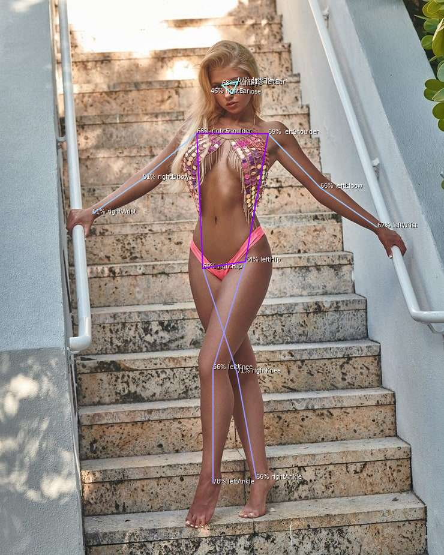

# MoveNet: Body Segmentation for TFJS and NodeJS

Models are included in `/model-*` folders  
Models descriptors have been additionally modified for readability  

Supports:

- `MoveNet-Lightning` **v3** and **v4**
- `MoveNet-Thunder` **v3** and **v4**
- `MoveNet-Multipose` **v1**

Performance:

- Lightning v3: 5.450ms
- Lightning v4: 5.481ms
- Thunder v3: 10.388ms
- Thunder v4: 10.508ms
- Multipose: 11.217ms

<br>

## Implementation

Actual model parsing implementation in `movenet.js` and `movenet-multipose.js` does not follow original  
and is implemented using native TFJS ops and optimized for JavaScript execution

Function `processResults()` takes `model.execute` output and returns array of 17 keypoints:

- id
- score: score as number
- label: annotated body part as string
- xRaw: x coordinate normalized to 0..1
- yRaw: y coordinate normalized to 0..1
- x: x coordinate normalized to input image size
- y: y coordinate normalized to input image size

<br><hr><br>

## Example



## Test

```shell
node movenet.js inputs/model1.jpg
```

```js
2021-05-29 16:32:48 INFO:  movenet version 0.0.1
2021-05-29 16:32:48 INFO:  User: vlado Platform: linux Arch: x64 Node: v16.2.0
2021-05-29 16:32:49 INFO:  Loaded model { modelPath: 'file://model-lightning/movenet-lightning.json' } tensors: 178 bytes: 9299876
2021-05-29 16:32:49 INFO:  Model Signature {
  inputs: { 'input:0': { name: 'input:0', dtype: 'DT_INT32', tensorShape: { dim: [ { size: '1' }, { size: '192' }, { size: '192' }, { size: '3' }, [length]: 4 ] } } },
  outputs: { 'Identity:0': { name: 'Identity:0', dtype: 'DT_FLOAT', tensorShape: { dim: [ { size: '1' }, { size: '1' }, { size: '17' }, { size: '3' }, [length]: 4 ] } } }
}
2021-05-29 16:32:49 INFO:  Loaded image: inputs/model1.jpg inputShape: [ 938, 638, 3, [length]: 3 ] modelShape: [ 1, 192, 192, 3, [length]: 4 ] decoded size: 1795332
This model execution did not contain any nodes with control flow or dynamic output shapes. You can use model.execute() instead.
2021-05-29 16:32:49 INFO:  Inference time: 145 ms
2021-05-29 16:32:49 INFO:  Tensor output [ 1, 1, 17, 3, [length]: 4 ]
2021-05-29 16:32:49 INFO:  Processing time: 4 ms
2021-05-29 16:32:49 DATA:  Results: [
  { id: 0, label: 'nose', score: 0.851518988609314, xRaw: 0.133351668715477, yRaw: 0.4853442311286926, x: 309, y: 125 },
  { id: 1, label: 'leftEye', score: 0.7733256816864014, xRaw: 0.11329909414052963, yRaw: 0.501908540725708, x: 320, y: 106 },
  { id: 2, label: 'rightEye', score: 0.7870607376098633, xRaw: 0.11650494486093521, yRaw: 0.46030735969543457, x: 293, y: 109 },
  { id: 3, label: 'leftEar', score: 0.5259113311767578, xRaw: 0.11611292511224747, yRaw: 0.5221166610717773, x: 333, y: 108 },
  { id: 4, label: 'rightEar', score: 0.7544838786125183, xRaw: 0.12976181507110596, yRaw: 0.42634811997413635, x: 272, y: 121 },
  { id: 5, label: 'leftShoulder', score: 0.5883469581604004, xRaw: 0.1994987577199936, yRaw: 0.6012834906578064, x: 383, y: 187 },
  { id: 6, label: 'rightShoulder', score: 0.8768258094787598, xRaw: 0.23354817926883698, yRaw: 0.3692959249019623, x: 235, y: 219 },
  { id: 7, label: 'leftElbow', score: 0.7374638319015503, xRaw: 0.3235592842102051, yRaw: 0.6565064191818237, x: 418, y: 303 },
  { id: 8, label: 'rightElbow', score: 0.8474915623664856, xRaw: 0.3795775771141052, yRaw: 0.32592085003852844, x: 207, y: 356 },
  { id: 9, label: 'leftWrist', score: 0.6389445662498474, xRaw: 0.46755996346473694, yRaw: 0.6036725640296936, x: 385, y: 438 },
  { id: 10, label: 'rightWrist', score: 0.6672286987304688, xRaw: 0.4508911073207855, yRaw: 0.3890339136123657, x: 248, y: 422 },
  { id: 11, label: 'leftHip', score: 0.6918626427650452, xRaw: 0.49237537384033203, yRaw: 0.5632658004760742, x: 359, y: 461 },
  { id: 12, label: 'rightHip', score: 0.824874758720398, xRaw: 0.48929092288017273, yRaw: 0.42534327507019043, x: 271, y: 458 },
  { id: 13, label: 'leftKnee', score: 0.46882709860801697, xRaw: 0.6760866045951843, yRaw: 0.5007705688476562, x: 319, y: 634 },
  { id: 14, label: 'rightKnee', score: 0.5292187333106995, xRaw: 0.6698553562164307, yRaw: 0.5213510990142822, x: 332, y: 628 },
  { id: 15, label: 'leftAnkle', score: 0.4727800190448761, xRaw: 0.8808274865150452, yRaw: 0.44615471363067627, x: 284, y: 826 },
  { id: 16, label: 'rightAnkle', score: 0.23934555053710938, xRaw: 0.8793723583221436, yRaw: 0.5921049118041992, x: 377, y: 824 },
  [length]: 17
]
2021-05-29 16:32:49 STATE: Created output image: outputs/model1.jpg size: [ 638, 938, [length]: 2 ]
```

<br><hr><br>

## Credits

- Article <https://blog.tensorflow.org/2021/05/next-generation-pose-detection-with-movenet-and-tensorflowjs.html>
- Model Card SinglePose: <https://storage.googleapis.com/movenet/MoveNet.SinglePose%20Model%20Card.pdf>
- Model Card MultiPose: <https://storage.googleapis.com/movenet/MoveNet.MultiPose%20Model%20Card.pdf>
- Original NPM Package: <https://www.npmjs.com/package/@tensorflow-models/pose-detection>
- Model Download - Lighning variation: <https://tfhub.dev/google/movenet/singlepose/lightning/3>
- Model Download - Thunder variation: <https://tfhub.dev/google/movenet/singlepose/thunder/3>
